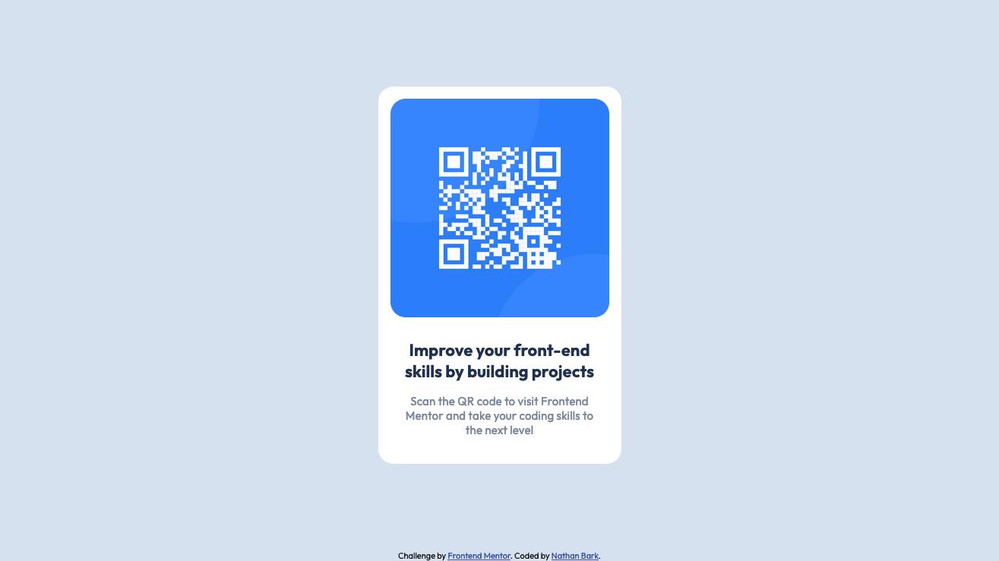

- [Overview](#overview)
  - [Screenshot](#screenshot)
  - [Links](#links)
- [My process](#my-process)
  - [Built with](#built-with)
  - [What I learned](#what-i-learned)
  - [Continued development](#continued-development)
  - [Useful resources](#useful-resources)
- [Acknowledgments](#acknowledgments)

## Overview

A QR component page challenge from frontendmentor.io. Using HTML and CSS.The challenge is to match the given design as closely as possible.

### Screenshot

### Links

- Solution URL: (https://github.com/nathan-bark/QR-code-component)
- Live Site URL: (https://62aee6f4b37d4a281599cb84--delicate-capybara-1b2e2e.netlify.app/)

## My process

I first started by simply laying out the structure with HTML, using the appropriate semantic tags. I then used CSS grid to place the component in the required location and make the page responsive to device/browser size. Then i finished off with the remaining styling in CSS.  

### Built with

- Semantic HTML5 markup
- CSS custom properties
- CSS grid

### What I learned

I got more practice in the different units available for use when sizing grids.

### Continued development

I will try to practice everyday using various sources

### Useful resources

## Acknowledgments
